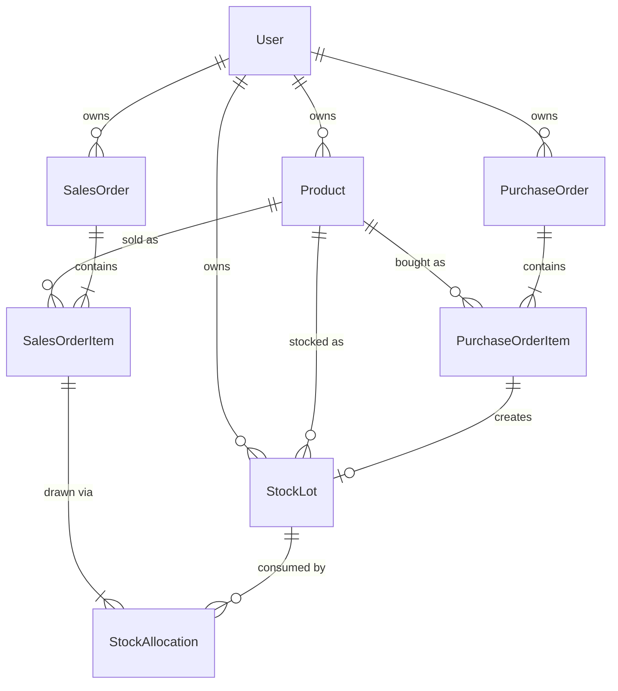

# Inventory Management System

A small operations platform for Food & Beverage CPG brands. You register
products, bring stock in with purchase orders, sell it with sales orders, and
see profit per product and across the whole business. Every user only sees their
own data.

The worked example from the brief (buy 100 units at $1, sell them at $10 for
$1,000 revenue, $900 profit, 900% margin) is reproduced by the demo seed and
checked by the test suite.

## Contents

- [Quick start (Docker)](#quick-start-docker)
- [Tech stack](#tech-stack)
- [Architecture and key decisions](#architecture-and-key-decisions)
- [Data model](#data-model)
- [How profit is calculated](#how-profit-is-calculated)
- [Project structure](#project-structure)
- [API reference](#api-reference)
- [Authentication and data isolation](#authentication-and-data-isolation)
- [Testing](#testing)
- [Local development without Docker](#local-development-without-docker)
- [Deployment (Render)](#deployment-render)
- [Known limitations and next steps](#known-limitations-and-next-steps)

## Quick start (Docker)

You only need Docker. From the repository root:

```bash
docker compose up --build
```

That brings up three services:

| Service    | URL                     | Notes                            |
| ---------- | ----------------------- | -------------------------------- |
| `db`       | localhost:5432          | PostgreSQL 16                    |
| `backend`  | http://localhost:8000   | Django REST API (auto-migrates)  |
| `frontend` | http://localhost:5173   | React app (Vite dev server)      |

On first start the backend seeds a demo account so the app isn't empty. Open
http://localhost:5173 and log in with:

```
username: demo
password: demo12345
```

Seeding only runs when the demo user doesn't already exist, so restarting won't
wipe anything. To reset back to the sample data:

```bash
docker compose exec backend python manage.py seed_demo
```

API docs (Swagger UI) live at http://localhost:8000/api/docs/. For the Django
admin, create a superuser with
`docker compose exec backend python manage.py createsuperuser`.

## Tech stack

Backend: Python 3.12, Django 5.2, Django REST Framework, PostgreSQL, SimpleJWT
for auth, drf-spectacular for the OpenAPI schema, django-filter, WhiteNoise and
Gunicorn. Tests use pytest and pytest-django.

Frontend: TypeScript and React 19 (Vite), Mantine for components, Tailwind for
the bits of utility styling Mantine doesn't cover, TanStack Query for server
state, Axios for HTTP, and React Router.

Infra: Docker Compose for local dev and a Render Blueprint (`render.yaml`) for
deployment.

## Architecture and key decisions

**Two independent pieces.** `backend/` and `frontend/` talk only over the REST
API, so either can be deployed or scaled on its own.

**Stock is tracked as lots, costed FIFO.** The brief says each stock has a unique
identifier and that "product stocks are sold", so I modelled stock as discrete
lots (`StockLot`), each with its own cost basis. A sale draws from the oldest
lots first and records exactly how much it took from each. That gives a precise
cost of goods sold per sale rather than a running-average approximation, matches
how batch-based food goods actually move, and leaves an audit trail. The
[profit section](#how-profit-is-calculated) walks through it.

**JWT auth.** A React SPA fits stateless bearer tokens well. SimpleJWT issues an
access and a refresh token; the frontend refreshes the access token on its own
when it expires.

**Data isolation is built into the base classes, not bolted on per view.** Every
owned model has an `owner` foreign key. A shared viewset base (`OwnedQuerysetMixin`)
filters every queryset to the current user and stamps the owner on create, and an
`IsOwner` object permission backs it up. Serializers also reject foreign keys
that point at another user's objects, so you can't, say, file a purchase order
against someone else's product.

**Business logic sits in plain functions, not views.** FIFO allocation is in
`apps/inventory/services.py` and the profit math is in `apps/core/analytics.py`.
Both are easy to unit test and are reused by the per-product endpoint and the
dashboard.

## Data model



- **Product**: name, description, SKU (unique per owner), unit (kg, g, L, mL or
  unit).
- **PurchaseOrder / PurchaseOrderItem**: buying stock. Each received item creates
  a `StockLot`.
- **StockLot**: a batch with a `unit_cost`, `quantity_received`,
  `quantity_remaining`, `received_date` and a unique `lot_code`. Manually added
  stock is just a lot with no source purchase item.
- **SalesOrder / SalesOrderItem**: selling stock. Each item is filled FIFO.
- **StockAllocation**: the FIFO ledger row recording which lot a sale drew from,
  how much, and at what cost. A sale item's COGS is the sum of its allocations.

## How profit is calculated

When a sales-order item for some quantity is created, `allocate_stock_fifo` in
`apps/inventory/services.py`:

1. Locks the product's open lots (`select_for_update`) ordered oldest first.
2. Draws the quantity across those lots, writing one `StockAllocation` per lot it
   touches and decrementing each lot's remaining quantity.
3. Rejects the whole sale and rolls back if there isn't enough stock, so you
   can't oversell.

`apps/core/analytics.py` then derives the numbers for a product or the whole
account:

```
revenue = sum(sold_qty * unit_price)
cogs    = sum(allocation cost)        # the actual lot costs consumed
profit  = revenue - cogs
margin  = profit / cogs * 100         # 900% for the worked example
```

Deleting a sales order returns the consumed quantities to their lots, so
inventory and COGS stay consistent.

## Project structure

```
backend/
  config/                 # settings (env-driven), urls, wsgi
  apps/
    core/                 # base owned model, owner-scoped viewset, IsOwner,
                          #   profit analytics, dashboard, seed_demo
    accounts/             # register / me / JWT endpoints
    products/             # Product + per-product financials endpoint
    purchasing/           # PurchaseOrder + items (creates stock lots)
    inventory/            # StockLot, StockAllocation, FIFO service
    sales/                # SalesOrder + items (consumes stock FIFO)
  tests/                  # pytest: FIFO, worked example, API, isolation
frontend/
  src/
    api/                  # axios client (JWT refresh) + typed TanStack hooks
    auth/                 # AuthProvider, token storage, ProtectedRoute
    components/           # app shell and reusable UI pieces
    pages/                # login, register, dashboard, products, stock, orders
docker-compose.yml        # db + backend + frontend for local dev
render.yaml               # one-click cloud deploy
```

## API reference

Base URL is `/api`. Resource endpoints need an `Authorization: Bearer <access>`
header. The full interactive docs are at `/api/docs/`, generated from the schema
at `/api/schema/`.

### Auth

| Method | Path                   | Purpose                         |
| ------ | ---------------------- | ------------------------------- |
| POST   | `/auth/register/`      | Create an account               |
| POST   | `/auth/token/`         | Log in, returns access+refresh  |
| POST   | `/auth/token/refresh/` | Exchange a refresh token        |
| GET    | `/auth/me/`            | Current user                    |

### Resources (CRUD via viewsets, scoped to the current user)

| Path                         | Notes                                                     |
| ---------------------------- | --------------------------------------------------------- |
| `/products/`                 | CRUD. Search with `?search=`, filter with `?unit=`.       |
| `/products/{id}/financials/` | Revenue, COGS, profit, margin and on-hand for a product.  |
| `/stock-lots/`               | List and retrieve lots; POST adds stock manually.         |
| `/purchase-orders/`          | CRUD with nested `items`; receiving creates stock lots.   |
| `/sales-orders/`             | CRUD with nested `items`; selling consumes stock FIFO.    |
| `/dashboard/`                | Account-wide totals plus a per-product breakdown.         |

Create a purchase order and receive stock in one request:

```jsonc
POST /api/purchase-orders/
{
  "order_date": "2024-01-05",
  "supplier": "Acme Wholesale",
  "items": [{ "product": 1, "quantity": "100", "unit_cost": "1.00" }]
}
```

Record a sale (COGS is computed FIFO on the server):

```jsonc
POST /api/sales-orders/
{
  "order_date": "2024-02-01",
  "items": [{ "product": 1, "quantity": "100", "unit_price": "10.00" }]
}
// response includes total_revenue 1000, total_cogs 100, total_profit 900
```

## Authentication and data isolation

Logging in returns a short-lived access token (60 min) and a longer refresh
token (7 days), kept in `localStorage`. The Axios client in
`frontend/src/api/client.ts` adds the access token to every request; on a 401 it
uses the refresh token to get a new access token and retries the original
request, sharing one in-flight refresh so parallel requests don't each trigger
their own. If the refresh fails the session is cleared and the user goes back to
login.

On the server, every owned queryset is filtered to the requesting user and
serializers reject foreign keys to other users' objects. The data-isolation
tests cover both read and write paths.

## Testing

```bash
docker compose run --rm backend pytest -q
```

The suite focuses on the business logic and the API contract:

- FIFO and profit: the worked example, oldest-lot-first consumption across
  multiple lots, partial sales, and blended COGS.
- Guards: overselling is rejected and leaves stock untouched; deleting an
  in-use product returns 409 rather than erroring.
- Aggregation: product- and dashboard-level revenue, COGS, profit and margin.
- Validation: SKU is unique per owner (and reusable across owners).
- API: auth is required, register/login works, orders are created with their
  line items, and users can't see or touch each other's data.

## Local development without Docker

The backend needs Python 3.12+ and a PostgreSQL instance.

```bash
cd backend
python -m venv .venv && source .venv/bin/activate
pip install -r requirements.txt
cp .env.example .env          # set POSTGRES_HOST=localhost, adjust as needed
python manage.py migrate
python manage.py seed_demo
python manage.py runserver
```

```bash
cd frontend
npm install
echo "VITE_API_BASE_URL=http://localhost:8000/api" > .env.local
npm run dev
```

## Deployment (Render)

`render.yaml` is a Render Blueprint: a managed Postgres database, the backend as
a Dockerised web service, and the frontend as a static site.

1. Push the repo to GitHub.
2. On Render, choose New, then Blueprint, and pick the repo.
3. After the first deploy, fill in the two cross-service URLs and redeploy:
   `CORS_ALLOWED_ORIGINS` on the backend points at the frontend URL, and
   `VITE_API_BASE_URL` on the frontend points at the backend URL plus `/api`.

Both services fit the free tier. On deploy the backend runs migrations, seeds
the demo account (so you can log in at the live URL with demo / demo12345), and
serves its static files through WhiteNoise. Note that free services cold-start
after a period of inactivity, so the first request may take a little while.

## Known limitations and next steps

- Order line items are fixed once an order is created. A received lot may already
  be partly sold and a sale has already drawn from specific lots, so editing
  items in place could corrupt the ledger. The supported edit is to delete the
  order (a sale returns its stock) and create a new one. Editable orders with
  proper ledger reconciliation would be a good follow-up.
- Deleting a product that is referenced by orders or stock is blocked with a 409;
  remove the dependent orders first. Deleting a purchase order keeps the lots it
  brought in, since reversing received stock that may already be sold isn't safe.
- Margin is profit over COGS (markup), which is what the brief's 900% example
  asks for. Gross margin (profit over revenue) would be a one-line addition in
  `analytics.py`.
- Worth adding later: low-stock and expiry alerts for perishables, CSV
  import/export, rotating refresh tokens, and rate limiting.
```
