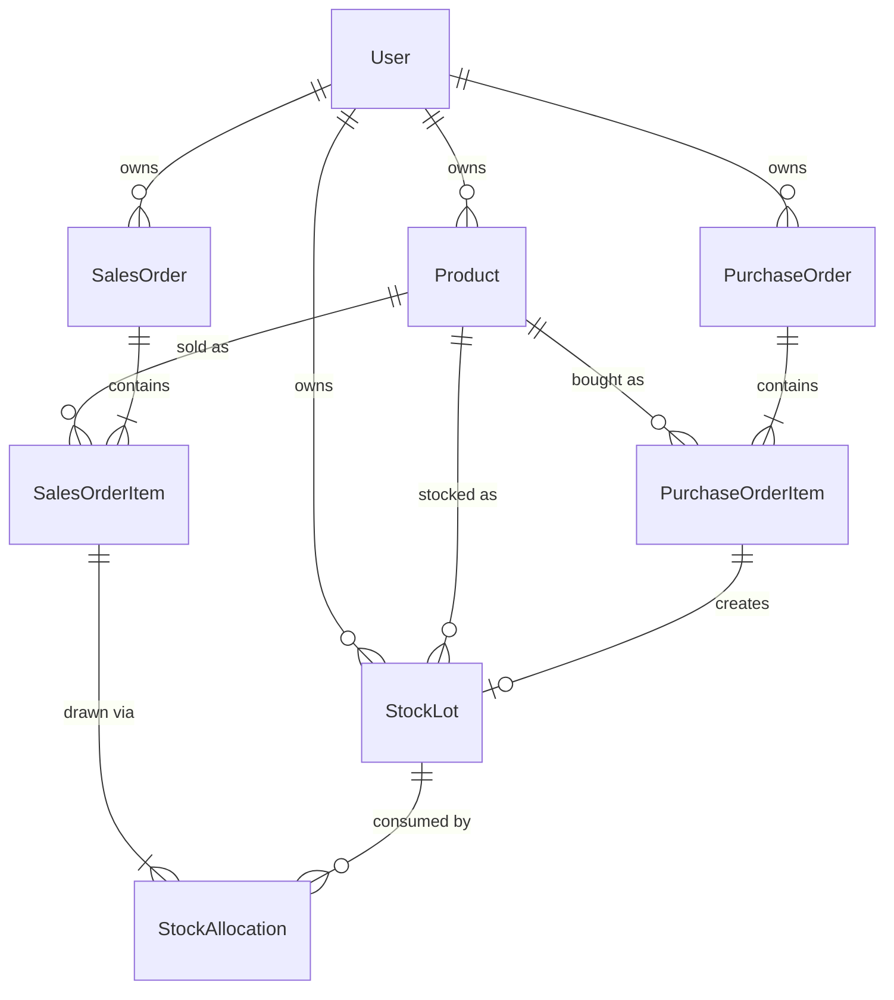

# Inventory Management System

An inventory, purchasing, sales and **profit-analysis** application for Food &
Beverage CPG brands. Users register products, bring stock in through purchase
orders, sell it through sales orders, and get accurate per-product and
portfolio-wide profit analysis — with every user seeing only their own data.

> **Worked example (from the spec):** buy 100 units @ $1 ($100 cost), sell 100 @
> $10 ($1,000 revenue) → **profit $900, margin 900 %**. This is reproduced by the
> seed data and asserted by the test suite.

---

## Table of contents

- [Quick start (Docker)](#quick-start-docker)
- [Tech stack](#tech-stack)
- [Architecture & key decisions](#architecture--key-decisions)
- [Data model (ERD)](#data-model-erd)
- [How profit is calculated (FIFO)](#how-profit-is-calculated-fifo)
- [Project structure](#project-structure)
- [API reference](#api-reference)
- [Authentication & data isolation](#authentication--data-isolation)
- [Testing](#testing)
- [Local development (without Docker)](#local-development-without-docker)
- [Deployment (Render)](#deployment-render)
- [Trade-offs & what I'd do next](#trade-offs--what-id-do-next)

---

## Quick start (Docker)

Requires Docker. From the repository root:

```bash
docker compose up --build
```

This starts three services:

| Service    | URL                            | Notes                              |
| ---------- | ------------------------------ | ---------------------------------- |
| `db`       | localhost:5432                 | PostgreSQL 16                      |
| `backend`  | http://localhost:8000          | Django REST API (auto-migrates)   |
| `frontend` | http://localhost:5173          | React app (Vite dev server, HMR)  |

On first start the backend **auto-seeds a demo account** with sample data (the
worked example + extras), so the app isn't empty. Open
**http://localhost:5173** and log in with:

```
username: demo
password: demo12345
```

> Auto-seeding only runs when the demo user doesn't exist yet, so restarts never
> wipe your data. To force a reset to the sample data at any time:
>
> ```bash
> docker compose exec backend python manage.py seed_demo
> ```

- **API docs (Swagger):** http://localhost:8000/api/docs/
- **Django admin:** http://localhost:8000/admin/ (create a superuser with
  `docker compose exec backend python manage.py createsuperuser`)

---

## Tech stack

**Backend** — Python 3.12, Django 5.2, Django REST Framework, PostgreSQL,
`djangorestframework-simplejwt` (JWT auth), `drf-spectacular` (OpenAPI/Swagger),
`django-filter`, WhiteNoise, Gunicorn. Tested with `pytest` + `pytest-django`.

**Frontend** — TypeScript, React 19 (Vite), Mantine 9 (UI), Tailwind 4 (utility
styling), TanStack Query (server state), Axios (HTTP + JWT refresh), React Router.

**Infra** — Docker / docker-compose, Render Blueprint (`render.yaml`).

---

## Architecture & key decisions

**Monorepo, two deployables.** `backend/` (API) and `frontend/` (SPA) are
independent and talk only over the REST API, so each can be deployed and scaled
on its own.

**Per-lot FIFO inventory costing.** The spec says *"each stock has a unique
identifier"* and *"product stocks are sold"*. I modelled stock as discrete
**lots** (`StockLot`), each carrying its own cost basis. Sales consume lots
oldest-first and record the exact cost drawn from each lot. This gives accurate
cost-of-goods-sold per sale (not an approximation), is the realistic model for
batch-based F&B goods, and keeps a full audit trail. See
[How profit is calculated](#how-profit-is-calculated-fifo).

**JWT authentication.** A React SPA pairs naturally with stateless bearer
tokens. Access + refresh tokens via SimpleJWT; the frontend transparently
refreshes expired access tokens (see [auth](#authentication--data-isolation)).

**Data isolation by construction.** Every owned model carries an `owner` FK, and
all viewsets inherit a base that filters every queryset to
`owner=request.user` and stamps the owner on create, backed by an `IsOwner`
object-level permission. A user literally cannot query another user's rows.

**Thin views, logic in services.** The FIFO allocation lives in
`apps/inventory/services.py`, and profit aggregation in
`apps/core/analytics.py` — so it's unit-testable in isolation and reused by both
the per-product endpoint and the dashboard.

---

## Data model (ERD)



- **Product** — name, description, SKU (unique per owner), unit (`KG/G/L/ML/UNIT`).
- **PurchaseOrder / PurchaseOrderItem** — buying stock; each item creates a `StockLot`.
- **StockLot** — a batch with `unit_cost`, `quantity_received`,
  `quantity_remaining`, `received_date`, and a unique `lot_code`. Manual stock
  is a lot with no source purchase item.
- **SalesOrder / SalesOrderItem** — selling stock; each item is filled FIFO.
- **StockAllocation** — the FIFO ledger: which lot a sale drew from, how much,
  and at what cost. A sale item's **COGS = Σ allocation cost**.

---

## How profit is calculated (FIFO)

When a sales-order item for *Q* units is created
(`apps/inventory/services.py::allocate_stock_fifo`):

1. The product's open lots are locked (`select_for_update`) and ordered oldest
   first.
2. Quantity is drawn greedily across lots, creating a `StockAllocation` per lot
   touched and decrementing each lot's `quantity_remaining`.
3. If on-hand stock is less than *Q*, the whole sale is rejected (no overselling)
   and rolled back atomically.

Then, for any product or for the whole account
(`apps/core/analytics.py`):

```
revenue  = Σ (sold_qty × unit_price)
COGS     = Σ allocation cost          (exact lot costs consumed)
profit   = revenue − COGS
margin % = profit / COGS × 100        (so the spec example yields 900 %)
```

Deleting a sales order **restores** the consumed quantities to their lots, so
inventory and COGS stay consistent.

---

## Project structure

```
backend/
  config/                 # settings (env-driven), urls, wsgi
  apps/
    core/                 # BaseOwnedModel, owner-scoped viewset, IsOwner,
                          #   analytics (profit math), dashboard, seed_demo
    accounts/             # register / me / JWT endpoints
    products/             # Product + per-product financials endpoint
    purchasing/           # PurchaseOrder + items (creates stock lots)
    inventory/            # StockLot, StockAllocation, FIFO service
    sales/                # SalesOrder + items (consumes stock FIFO)
  tests/                  # pytest: FIFO, worked example, API, isolation
frontend/
  src/
    api/                  # axios client (JWT refresh) + typed TanStack hooks
    auth/                 # AuthProvider, token storage, ProtectedRoute
    components/           # AppLayout, reusable form/table pieces
    pages/                # login, register, dashboard, products, stock, orders
docker-compose.yml        # db + backend + frontend for local dev
render.yaml               # one-click cloud deploy
```

---

## API reference

Base URL: `/api`. All resource endpoints require `Authorization: Bearer <access>`.
Full interactive docs at **`/api/docs/`** (OpenAPI schema at `/api/schema/`).

### Auth
| Method | Path                   | Purpose                          |
| ------ | ---------------------- | -------------------------------- |
| POST   | `/auth/register/`      | Create an account                |
| POST   | `/auth/token/`         | Log in → `access` + `refresh`    |
| POST   | `/auth/token/refresh/` | Exchange refresh for new access  |
| GET    | `/auth/me/`            | Current user                     |

### Resources (CRUD via ViewSets, scoped to the current user)
| Path                          | Notes                                                      |
| ----------------------------- | ---------------------------------------------------------- |
| `/products/`                  | CRUD. Search `?search=`, filter `?unit=`.                  |
| `/products/{id}/financials/`  | Revenue, COGS, profit, margin, on-hand for one product.    |
| `/stock-lots/`                | List/retrieve lots; `POST` adds stock manually.            |
| `/purchase-orders/`           | CRUD with nested `items[]`; receiving creates stock lots.  |
| `/sales-orders/`              | CRUD with nested `items[]`; selling consumes stock FIFO.   |
| `/dashboard/`                 | Account-wide totals + per-product breakdown.               |

**Create a purchase order (and receive stock) in one call:**

```jsonc
POST /api/purchase-orders/
{
  "order_date": "2024-01-05",
  "supplier": "Acme Wholesale",
  "items": [{ "product": 1, "quantity": "100", "unit_cost": "1.00" }]
}
```

**Record a sale (COGS computed FIFO):**

```jsonc
POST /api/sales-orders/
{
  "order_date": "2024-02-01",
  "items": [{ "product": 1, "quantity": "100", "unit_price": "10.00" }]
}
// → total_revenue 1000, total_cogs 100, total_profit 900
```

---

## Authentication & data isolation

- Login returns short-lived **access** (60 min) and longer-lived **refresh**
  (7 days) tokens, stored in `localStorage` on the client.
- The Axios client (`frontend/src/api/client.ts`) attaches the access token to
  every request and, on a `401`, transparently uses the refresh token to get a
  new access token and replays the request (a single shared promise dedupes
  concurrent refreshes). If refresh fails, the session is cleared and the user
  is sent to login.
- On the server, **every** owned queryset is filtered to the requesting user and
  serializers reject foreign-key references to other users' objects, so one user
  can never read or write another's products, orders or stock. This is covered
  by tests.

---

## Testing

```bash
docker compose run --rm backend pytest -q
```

The suite (`backend/tests/`) covers the core business logic and API contract:

- **FIFO & profit** — the exact worked example (profit 900 / margin 900 %),
  multi-lot oldest-first consumption, partial sales, blended COGS.
- **Guards** — overselling is rejected and leaves stock untouched.
- **Aggregation** — product- and dashboard-level revenue/COGS/profit/margin.
- **Model validation** — SKU unique per owner (shared across owners is fine).
- **API** — auth required, register/login flow, nested order creation, and
  **data isolation** between users.

---

## Local development (without Docker)

Backend needs Python 3.12+ and a PostgreSQL instance.

```bash
cd backend
python -m venv .venv && source .venv/bin/activate
pip install -r requirements.txt
cp .env.example .env          # adjust POSTGRES_* / set POSTGRES_HOST=localhost
python manage.py migrate
python manage.py seed_demo
python manage.py runserver
```

```bash
cd frontend
npm install
echo "VITE_API_BASE_URL=http://localhost:8000/api" > .env.local
npm run dev
```

---

## Deployment (Render)

`render.yaml` is a Render **Blueprint** describing a managed Postgres database, a
Dockerised backend web service, and the frontend as a static site.

1. Push this repo to GitHub.
2. On Render: **New + → Blueprint** and select the repo.
3. After the first deploy, set the two cross-service URLs and redeploy:
   - backend `CORS_ALLOWED_ORIGINS` → the frontend URL
   - frontend `VITE_API_BASE_URL` → the backend URL + `/api`

Both services run on the free tier. The backend Dockerfile serves static files
via WhiteNoise and runs migrations on deploy.

---

## Trade-offs & what I'd do next

- **Order line items are immutable** once created. A received purchase lot may
  already be partly sold, and a sale already consumed specific lots — editing
  them in place would corrupt the FIFO ledger. The clean, consistent model is:
  delete (which restores stock) and recreate. Editable orders with ledger
  reconciliation would be the next iteration.
- **Dashboard aggregation** runs a handful of queries per product. Fine for
  realistic catalog sizes; for very large catalogs I'd precompute or annotate in
  a single grouped query.
- **Margin = profit / COGS** (markup) to match the spec's 900 % example; a real
  product might also surface gross margin (profit / revenue). Both are one line
  in `analytics.py`.
- **Next:** low-stock alerts, expiry/lot dates for F&B, CSV import/export,
  rotating refresh tokens, and per-request rate limiting.
```
